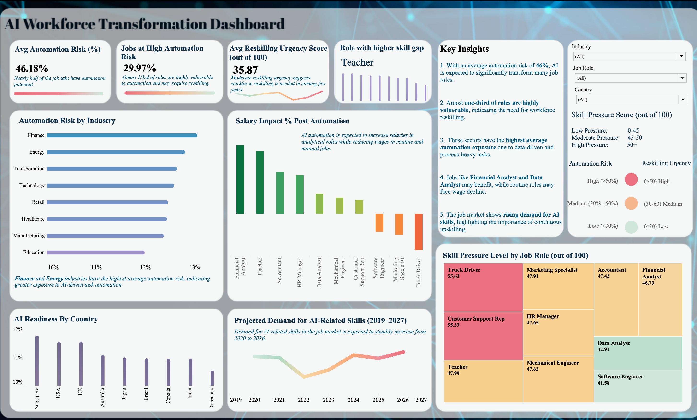

# AI Workforce Transformation Dashboard — Tableau

Interactive dashboard analysing AI-driven workforce disruption 
across 8+ industries and 9 countries.

## Key Features
- Automation Risk by Industry
- Reskilling Urgency Scores
- Skill Pressure by Job Role
- AI Readiness by Country (2019–2027)

## Data Used

https://github.com/NamrataVerma1998/Business-Analyst-Projects/blob/main/AI-Workforce-Dashboard-Tableau/ai_job_replacement_2020_2026_DataSet.xlsx

## Screenshot

## Tools Used
Tableau Desktop

## Key Insights

**1. High Automation Risk Overall:** Average automation risk is 46.18% — nearly half of all job roles face significant AI disruption threat.

**2. Almost 1/3rd Jobs Highly Vulnerable:** 29.97% of roles fall under high automation risk category, indicating urgent need for workforce reskilling across industries.

**3. Finance & Energy Most at Risk:** These two industries show the highest automation exposure — driven by data-heavy, process-driven, and repetitive task structures.

**4. Moderate Reskilling Urgency:** Average Reskilling Urgency Score is 35.87 out of 100 — suggesting reskilling needs are real but there's still a window to act before mass displacement.

**5. Teacher Has the Highest Skill Gap:** Among all roles, Teacher shows the highest skill gap score — an unexpected finding highlighting that even non-technical roles are under pressure.

**6. Truck Driver & Customer Support Rep Under Most Pressure:** Skill Pressure scores: Truck Driver (55.63) and Customer Support Rep (55.33) — both routine, manual roles facing the highest displacement risk.

**7. Analytical Roles Will Benefit:** Financial Analyst and Data Analyst roles are expected to see salary increases post-automation, while routine roles face wage decline.

**8. AI Skills Demand Rising Steadily:** Projected demand for AI-related skills shows a consistent upward trend from 2020 to 2026, highlighting the urgency for continuous upskilling.

**9. Singapore Leads in AI Readiness:** Among 9 countries, Singapore shows the highest AI readiness score, followed by USA and UK.
